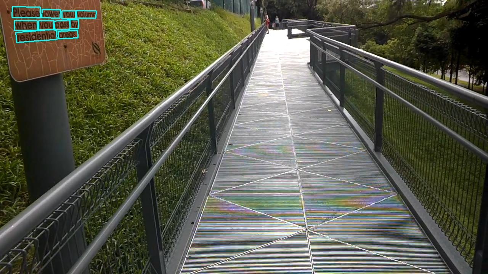
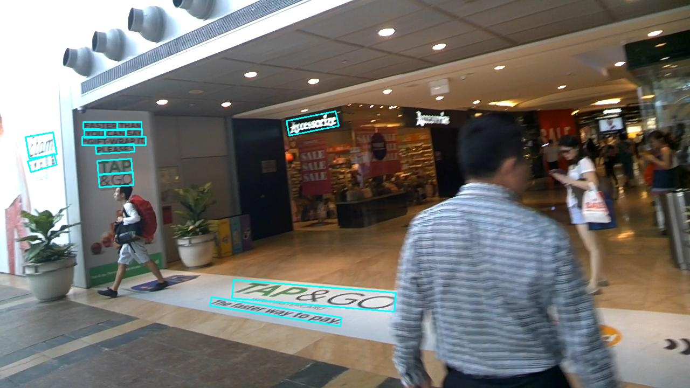
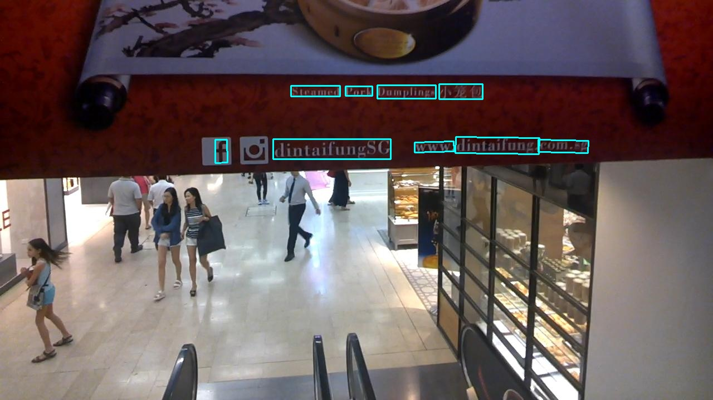

# PSENet: Shape Robust Text Detection with Progressive Scale Expansion Network

### Introduction
This is a tensorflow re-implementation of [PSENet: Shape Robust Text Detection with Progressive Scale Expansion Network](https://arxiv.org/abs/1806.02559).

Thanks for the author's ([@whai362](https://github.com/whai362)) awesome work!

### Installation
1. Any version of tensorflow version > 1.0 should be ok.
2. python 2 or 3 will be ok.

### Download
trained on ICDAR 2015 (training set) + ICDAR2017 MLT (training set): 

[baiduyun](https://pan.baidu.com/s/14tQHf9MjuD0lSmwkoZhnCg)  extract code: pffd

[google drive](https://drive.google.com/file/d/1TjJvtwMp8hJXQhn6Yz2lbPdvBGH-ZQ8u/view?usp=sharing)

This model is not as good as article's, it's just a reference.
You can finetune on it or you can do a lot of optimization based on this code. 

| Database | Precision (%) | Recall (%) | F-measure (%) | 
| - | - | - | - |
| ICDAR 2015(val) | 74.61 | 80.93 | 77.64 |


### Train
If you want to train the model, you should provide the dataset path, in the dataset path, a separate gt text file should be provided for each image, and **make sure that gt text and image file have the same names**.

Then run train.py like:

```
python train.py --gpu_list=0 --input_size=512 --batch_size_per_gpu=8 --checkpoint_path=./resnet_v1_50/ \
--training_data_path=./data/ocr/icdar2015/
```

If you have more than one gpu, you can pass gpu ids to gpu_list(like --gpu_list=0,1,2,3)

**Note:**
1. right now , only support icdar2017 data format input, like (116,1179,206,1179,206,1207,116,1207,"###"),
but you can modify data_provider.py to support polygon format input
2. Already support polygon shrink by using pyclipper module
3. this re-implementation is just for fun, but I'll continue to improve this code.
4. re-implementation pse algorithm by using c++
***(if you use python2, just run it, if python3, please replace python-config with python3-config in makefile)***

### Test
run eval.py like:
```
python eval.py --test_data_path=./tmp/images/ --gpu_list=0 --checkpoint_path=./resnet_v1_50/ \
--output_dir=./tmp/
```

a text file and result image will be then written to the output path.

### Examples







### About issues
If you encounter any issue check issues first, or you can open a new issue.

### Reference
1. http://download.tensorflow.org/models/resnet_v1_50_2016_08_28.tar.gz
2. https://github.com/CharlesShang/FastMaskRCNN
3. https://github.com/whai362/PSENet/issues/15
4. https://github.com/argman/EAST

### Acknowledge
[@rkshuai](https://github.com/rkshuai) found a bug about concat features in model.py.

**If this repository helps you，please star it. Thanks.**
